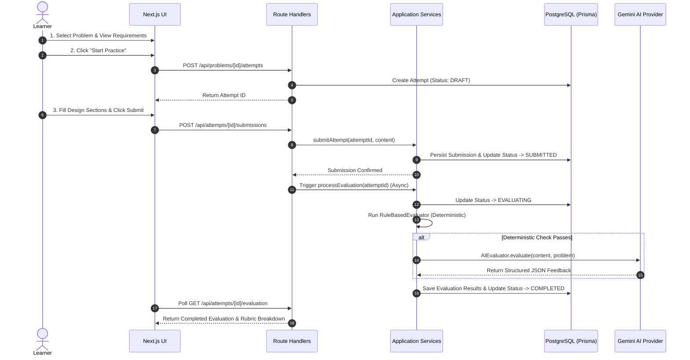

# Low-Level Design (LLD) Practice Platform — System Architecture & Design Document

## 1. MVP Scope
The LLD Practice Platform (LLD Coach) is a modular web application built for engineers to practice object-oriented design problems. The MVP scope includes:
* Curated problem catalog (Parking Lot, Vending Machine, Elevator System, Library Management).
* Structured multi-section text submission workspace.
* Hybrid evaluation engine combining deterministic checks with an AI evaluator powered by Google Gemini.
* Structured feedback breakdown featuring scores, evidence quotes, concerns, suggestions, and confidence scores.
* Persistent attempt tracking and problem retry flow.

---

## 2. Core User Journey


---

## 3. Modular Architecture
The system adheres to a **Clean / Layered Monolith Architecture**:

```
src/
├── app/                  # Presentation Layer (Next.js App Router UI & Route Handlers)
│   ├── api/              # RESTful API route endpoints
│   ├── attempts/         # Attempt workspace, history, & feedback UI
│   └── problems/         # Problem catalog & detailed requirements UI
├── components/           # Shared UI Components (Header, Badges, Status Cards)
├── domain/               # Domain Core (Pure TypeScript Types, Entities & Interfaces)
│   ├── attempt/          # Attempt entity & status types
│   ├── evaluation/       # Evaluator interface & evaluation result schemas
│   ├── problem/          # Problem, Requirement, Rubric domain aggregates
│   └── submission/       # Submission discriminated union types
├── application/          # Use Cases & Application Logic
│   ├── attempts/         # Attempt creation & submission logic
│   ├── evaluation/       # Evaluation orchestration engine
│   └── problems/         # Problem query use cases
├── infrastructure/       # External Adapters & Implementations
│   ├── ai/               # Gemini AI Provider implementation
│   ├── database/         # Prisma ORM client instance
│   └── evaluation/       # RuleBasedEvaluator & AIEvaluator implementations
└── lib/                  # Centralized Config & Auth Helpers (`DEMO_USER_ID`)
```

---

## 4. Domain Model & Entities

### Aggregate Root: Problem
* `Problem`: `id`, `title`, `description`, `difficulty`
* `Requirement`: `id`, `problemId`, `text`
* `Rubric`: `id`, `problemId`
* `RubricCriterion`: `id`, `rubricId`, `dimension`, `description`, `maxScore`

### Entity: Attempt
* `Attempt`: `id`, `problemId`, `userId`, `status` (`DRAFT | SUBMITTED | EVALUATING | COMPLETED | FAILED`), `createdAt`, `updatedAt`

### Entity: Submission
* `Submission`: `id`, `attemptId`, `format` (`TEXT | DIAGRAM`), `content` (JSON payload)

### Entity: Evaluation
* `Evaluation`: `id`, `attemptId`, `status` (`EVALUATING | COMPLETED | FAILED`), `overallScore`, `error`
* `EvaluationResult`: `id`, `evaluationId`, `criterionId`, `score`, `evidence`, `concern`, `suggestion`, `confidence`

---

## 5. Key Interfaces & Abstractions

### `Evaluator` Interface ([`src/domain/evaluation/types.ts`](file:///Users/krishgupta/Documents/LLD-Practice-Platform/src/domain/evaluation/types.ts#L26-L31))
```typescript
export interface Evaluator {
  evaluate(
    submission: SubmissionContent,
    problem: ProblemWithDetails
  ): Promise<EvaluationResult>
}
```

### `LLMProvider` Interface ([`src/infrastructure/ai/types.ts`](file:///Users/krishgupta/Documents/LLD-Practice-Platform/src/infrastructure/ai/types.ts#L7-L12))
```typescript
export interface LLMProvider {
  complete(prompt: string): Promise<string>
}
```

---

## 6. Attempt State Machine

```mermaid
stateDiagram-v8
    [*] --> DRAFT: Learner starts attempt
    DRAFT --> SUBMITTED: Learner submits design
    SUBMITTED --> EVALUATING: Evaluation pipeline starts
    EVALUATING --> COMPLETED: Deterministic & AI checks pass
    EVALUATING --> FAILED: Validation or LLM error
    COMPLETED --> DRAFT: Learner clicks "Retry Problem"
    FAILED --> DRAFT: Learner clicks "Retry Problem"
```

1. **DRAFT**: Created when learner starts a problem.
2. **SUBMITTED**: Created atomically with submission persistence in a DB transaction.
3. **EVALUATING**: Transitioned before background evaluation starts.
4. **COMPLETED**: Evaluation finished successfully; results persisted.
5. **FAILED**: Evaluation encountered error or malformed output; error stored.

---

## 7. Submission & Evaluator Abstraction

### Submission Format Extensibility (Discriminated Union)
```typescript
export type SubmissionFormat = 'TEXT' | 'DIAGRAM' | 'CODE'

export interface TextSubmissionContent {
  type: 'TEXT'
  classesAndResponsibilities: string
  interfacesAndAbstractions: string
  relationships: string
  designExplanation: string
  tradeOffs: string
  edgeCases: string
}

export type SubmissionContent = TextSubmissionContent
```

---

## 8. Deterministic vs AI Evaluation Pipeline

Evaluation follows a two-tier strategy in [`src/application/evaluation/service.ts`](file:///Users/krishgupta/Documents/LLD-Practice-Platform/src/application/evaluation/service.ts):
1. **Tier 1 — `RuleBasedEvaluator`**: Checks whether all required design sections are filled out with sufficient length (>20 characters). If sections are missing or trivial, it immediately generates deterministic feedback with score 0 without incurring LLM cost.
2. **Tier 2 — `AIEvaluator`**: Runs when deterministic checks pass. Builds a rubric-guided prompt and calls `GeminiProvider` with strict `application/json` output schema. Validates LLM response using Zod.

---

## 9. Database Model & Schema

```prisma
model Problem {
  id          String   @id @default(uuid())
  title       String
  description String
  difficulty  String
  requirements Requirement[]
  rubrics      Rubric[]
  attempts     Attempt[]
}

model Attempt {
  id        String        @id @default(uuid())
  problemId String
  userId    String
  status    AttemptStatus @default(DRAFT)
  submission Submission?
  evaluation Evaluation?

  @@index([problemId])
  @@index([userId])
}

model Submission {
  id        String   @id @default(uuid())
  attemptId String   @unique
  content   String
  format    String   @default("TEXT")
}

model Evaluation {
  id           String           @id @default(uuid())
  attemptId    String           @unique
  status       EvaluationStatus
  overallScore Float?
  results      EvaluationResult[]
}

model EvaluationResult {
  id           String   @id @default(uuid())
  evaluationId String
  criterionId  String
  score        Float
  evidence     String?
  concern      String?
  suggestion   String?
  confidence   Float?

  @@index([evaluationId])
}
```

---

## 10. Failure & Error Handling
* **Atomicity**: Submissions are persisted *before* background evaluation starts. If AI evaluation crashes, the submission remains intact.
* **Malformed Output Protection**: `AIEvaluator` validates raw JSON with Zod (`aiEvaluationSchema`). Invalid JSON or missing keys trigger a safe `status: FAILED` result rather than crashing the server.
* **API Key Fallback**: If `GEMINI_API_KEY` is missing in environment, the system provides safe fallback deterministic feedback.

---

## 11. Conceptual Change Scenarios (Verification)

### Change Test A: Text Submission Today → Diagram Submission Later
* **Supported without rewriting core practice flow**:
  1. Add `DiagramSubmissionContent` (`type: 'DIAGRAM', plantUml: string`) to `SubmissionContent` discriminated union in `src/domain/submission/types.ts`.
  2. Implement a new UI component for diagram editing in `src/app/attempts/[id]/practice`.
  3. The `Submission` database schema already stores `format` and JSON `content`, requiring zero database schema changes.

### Change Test B: AI Evaluator Today → Rule-Based / Human Evaluator Later
* **Supported without rewriting core practice flow**:
  1. Implement `HumanEvaluator` or `AdvancedStaticAnalysisEvaluator` implementing the `Evaluator` interface (`evaluate(submission, problem)`).
  2. Inject the new evaluator inside `src/application/evaluation/service.ts`.
  3. UI polling and state machine remain completely untouched.

---

## 12. Key Trade-offs & Limitations
1. **Asynchronous Fire-and-Forget Evaluation**: Background processing avoids blocking HTTP responses, but relies on client polling (`GET /api/attempts/[id]/evaluation`).
2. **Demo User Session**: Uses centralized `DEMO_USER_ID = "demo-learner"` in `src/lib/auth.ts` instead of full JWT/OAuth authentication to keep focus on core practice mechanics.
3. **Text-Only MVP**: High-fidelity visual UML diagram editing is postponed to future phases.

---

## 13. Future Improvements
* Multi-user authentication & user profile dashboard.
* Diagram-based submissions using PlantUML / Mermaid rendering.
* Interactive AI follow-up chat on specific rubric suggestions.
